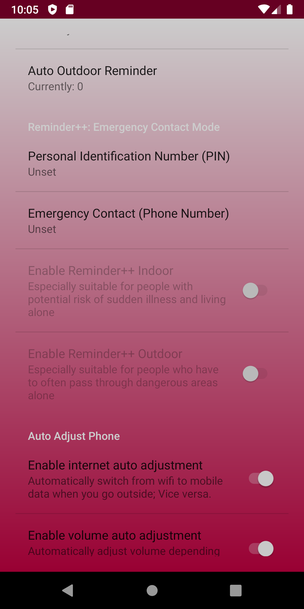
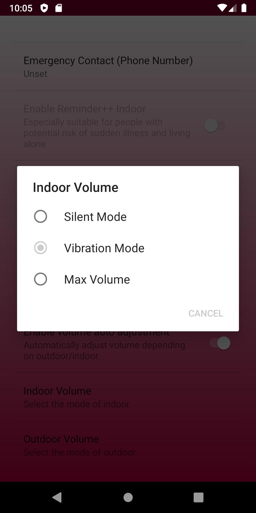
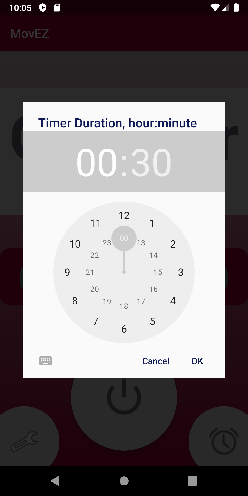
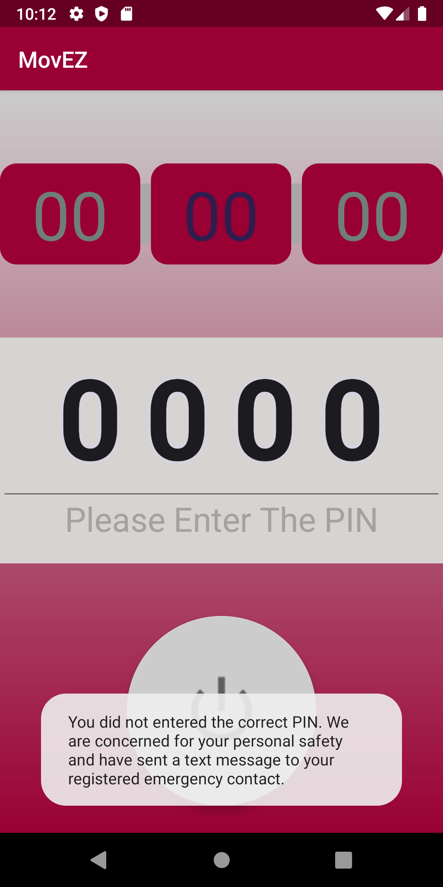

# MovEZ

## Design intention
- **background**: daily use & special for the pandemic
- **use-case**: helps regulate the daily health and safety of citizens
- **target users**: lazy people who wants the phone to configure itself, and people who is in potential danger (Vulnerable groups, people at risk of acute illness, etc.)

## Technology
This is a android application utilizing **Machine Learning** technologies to intelligently detect if a user is indoors or outdoors based on the sensors such as GPS signal noise, lightness, magnetic field and the number of active satellites.

## Privacy
Based on this powerful machine learning model, we can get the indoor/outdoor condition **without needing any sensitive private information.**

## Interesting Features
In the past 36 hours, we have developed three interesting features that is really helpful & practical in people's daily life, based on their indoor/outdoor activities:

Note that the features are highly configurable!

### 1. auto set phone status when shifting indoor/outdoor
- Auto toggle the **volume** of phone in 3 modes as configured:
	- Silent mode
	- Vibration mode
	- Max Volume mode
- Auto toggle the **internet** connection between:
	- mobile data
	- Wi-Fi

### 2. Push friendly notifications to users: 
As configured, user can open an auto reminder when they stay indoors or outdoors for a certain long period of time:
- Remind users to practice social distancing if outdoors
- Remind users to go out for some exercise if indoors

### 3. Reminder++: Emergency Contact Mode
If user have registered his/her emergency contact number, this app can provide below services to **save them from potential danger.**
- When the reminder rings, the user need to manually enter the PIN to turn off the reminder alarm; If the alarm failed to be turned off in a certain time period, or if an incorrect PIN is entered, **the app with send a a help message including current location will be sent to the emergency contact.**
	- Indoor: Especially suitable for people with potential risk of sudden illness and living alone
		- For example, some old people live alone can be have sudden heart attack, cerebral infarction and etc. If they stay indoor for a long time and be unable to turn off the alarm, perhaps something dangerous already happened.
	- Outdoor: Especially suitable for people who have to often pass through dangerous areas alone
		- For example, many females are worried about walking alone on the street in the night. Some international students who lives far from family also have similar concerns. 
		- Also, the PIN function help user's family, friends and polices to keep track of the situation if something bad happens, such as kidnapping, because the bad guy cannot turn off the alarm correctly.
		

## Screenshots

## What's next for MovEZ
- refining features
- improving the UX/UI
- fixing bugs
- trying to dig deeper into the several fun features we thought of when we were brainstorming before

