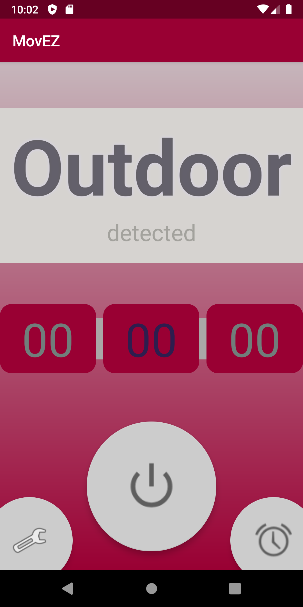
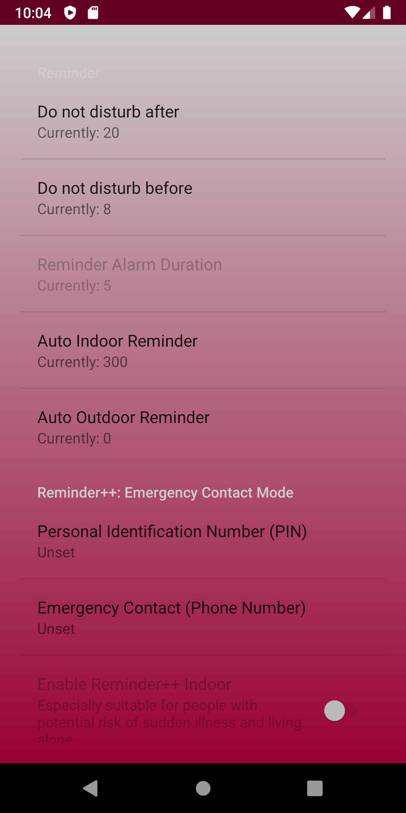

# MovEZ
> A Handy and Smart helper on Android: 

> Make your life easier and safer - Whenever you move

## Design intention
- **background**: daily use & special for the pandemic
- **use-case**: helps regulate the daily health and safety of citizens
- **target users**: lazy people who wants the phone to adjust itself to optimal state, and people who is in potential danger (Vulnerable groups, people at risk of acute illness, etc.)

## Technology
This is a android application utilizing **Machine Learning** technologies to intelligently detect if a user is indoors or outdoors based on the sensors such as GPS signal noise, lightness, magnetic field and the number of active satellites.

## Privacy Friendly
Based on this powerful machine learning model, we can get the indoor/outdoor condition **without needing any sensitive private information.**

## Interesting Features
In the past 36 hours, we have developed three interesting features that is really helpful & practical in people's daily life, based on their indoor/outdoor activities:

Note that the features are highly configurable!

### 1. auto set phone status when shifting indoor/outdoor
- Auto toggle the **volume** of phone in 3 modes as configured:
	- Silent mode
	- Vibration mode
	- Max Volume mode
- Auto toggle the **internet** connection between:
	- mobile data
	- Wi-Fi

### 2. Push friendly notifications to users: 
As configured, user can open an **auto periodic reminder** when they stay indoors or outdoors every several hours.

#### Example use cases:
- Remind users to *go out for some exercise if indoors*
- Remind users to *keep social distancing if outdoors*

#### No-Disturb Setting:
- **Smart**: Will not try to wake up a user and ask him/her to go out for a walk when the user is sleeping at night!

### 3. Reminder++: Emergency Contact Mode
If user have registered his/her emergency contact number, this app can provide below services to **save them from potential danger.**
- When the reminder rings, the user need to **enter the correct PIN** to turn off the reminder alarm
- **Send SOS message & current location to emergency contact**, If one of the following 2 things happens, *which indicates that the person is highly likely in trouble,*
	- if no correct PIN has been entered in 5 min (configurable)
	- if trying to leave this app interface without entering correct PIN (including turn the phone off)

#### Example use cases:
- **Indoor**: *Especially suitable for people with potential risk of sudden illness and living alone*
	- For example, some old people live alone can have sudden heart attack, cerebral infarction and etc. A timely SOS message can buy them valuable time to resuscitate an acute illness.
- **Outdoor**: *Especially suitable for people who have to often pass through dangerous areas alone*
	- For example, generally people are always worried about walking at night in empty, accident-prone streets. 
	- Some international students who lives far from family also have this concerns. 
	- if the user encountered kidnapping, assaulting, etc, the PIN will play a role: the bad guy who doesn't know the PIN trying to turn off the alarm will trigger a SOS message.

## Screenshots

## What's next for MovEZ
- refining features
- improving the UX/UI
- fixing bugs
- trying to dig deeper into the several fun features we thought of when we were brainstorming before
